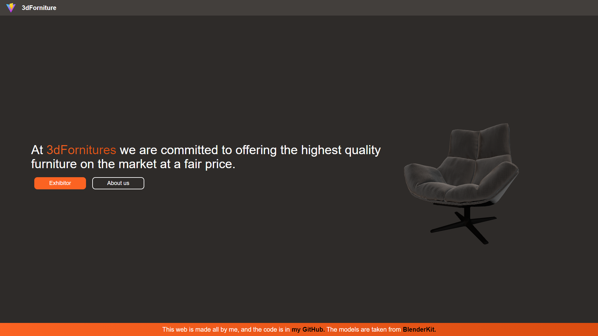
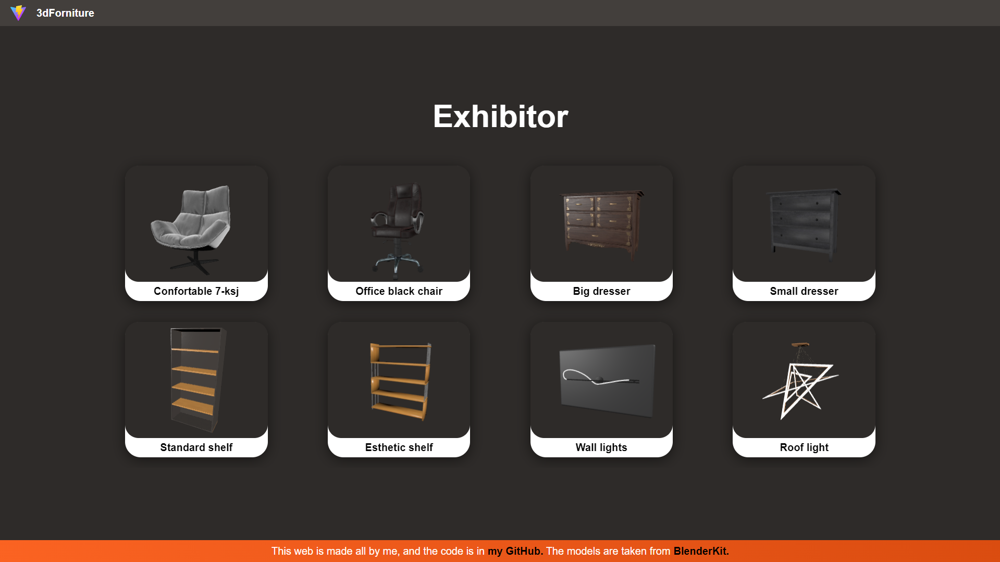
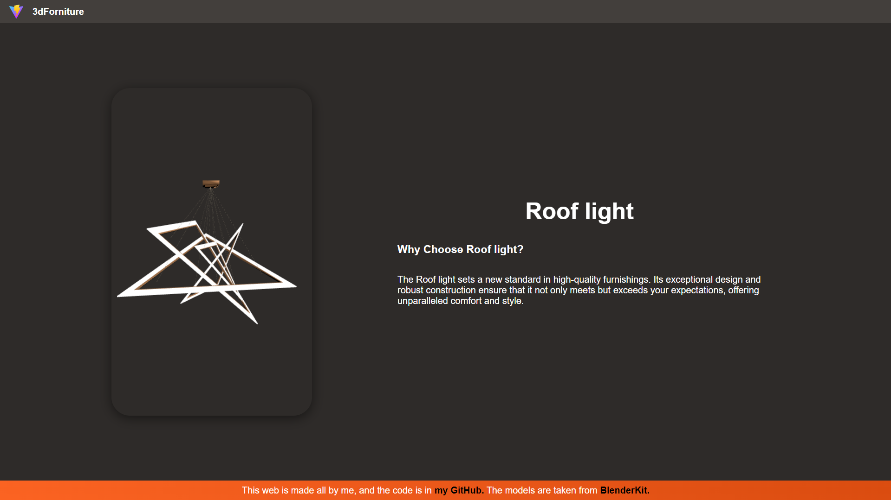
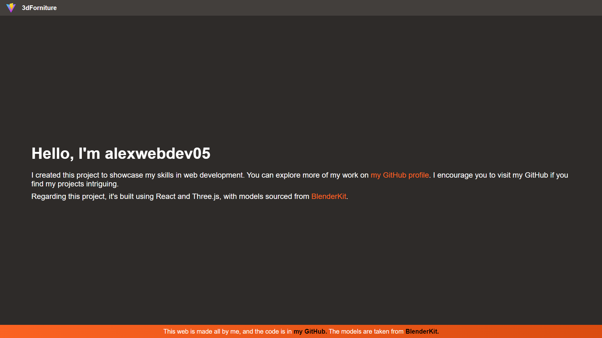

# Como iniciar el proyecto en local / How to start the project locally

``` bash
# Cambia la ruta / Change the path
cd ./3dForniture

npm run dev
```

## Info
Esta es una página estática hecha con React y Three.js. En ella creo varios componentes reutilizables y vistas de modelos 3D para crear una impresión visual que se salga de lo habitual.

This is a static page made with React and Three.js. In it, I create various reusable components and 3D model views to create a visual impression that stands out from the usual.

## Page URL
[3dFornitures](https://994ca11c.3dforniture.pages.dev/)

## Imagenes / Images



